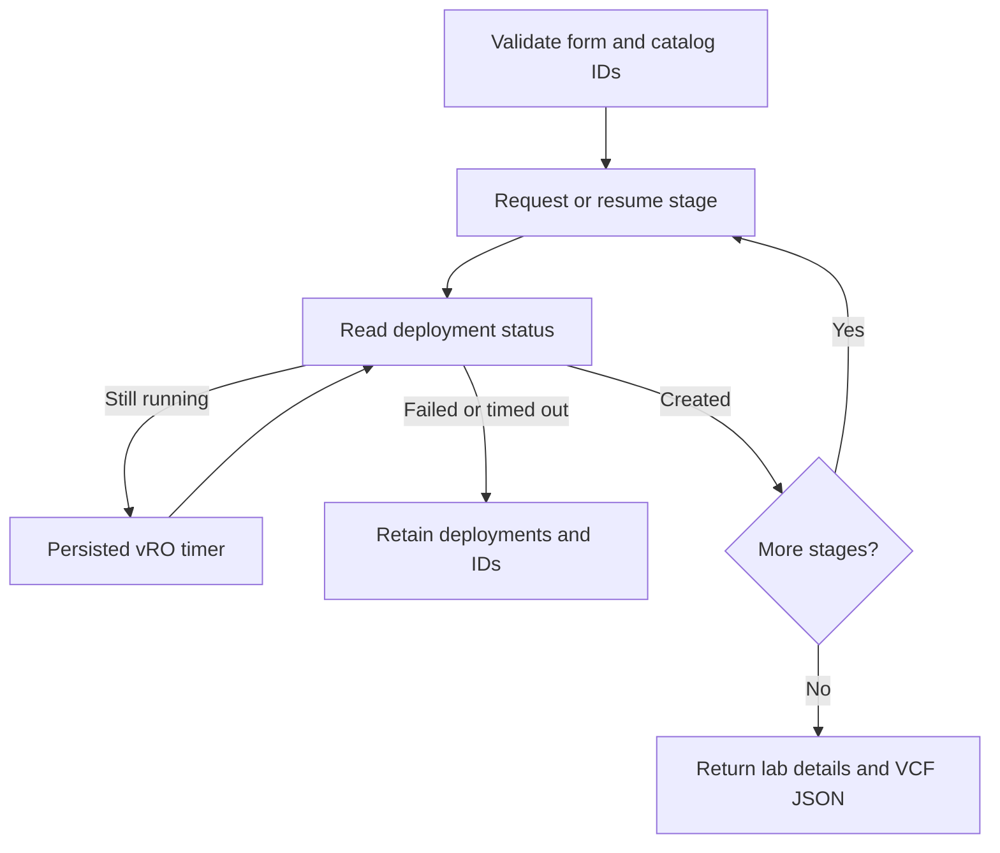

# Deploy Modular VCF Lab

This experimental workflow orders the four **Nested VCF Modular** catalog
items from the automation component. It lives under `src/modular`, with vRO
content in **Nested VCF Lab / Modular**. The existing naming example under
`src/lab` and the original Full Stack VCF blueprint remain available.

## Prepare the target

1. Publish the Foundation, ESXi, Installer and Jumphost blueprints from
   [`nested-vcf-automation/modular`](https://github.com/mtornblad/nested-vcf-automation/tree/main/modular).
   Release them and make all four catalog items available to the intended
   project. Record their **catalog item IDs**, not blueprint or deployment IDs.
2. Configure an authenticated **VCF Automation plugin connection** in vRO for
   the target All Apps organization. Use a shared session with access to the
   project, all four catalog items, and its deployment read/request APIs.
   Select its connection SID, or use the plugin's default connection.
3. Build and import this package using the private Maven profile described in
   the [component README](../README.md#target-configuration):

   ```bash
   make validate
   make package
   make push PROFILE=lab
   ```

4. Run **Configure Modular Catalog** in the new workflow folder. Enter a profile
   name, connection SID, project UUID, and the four catalog item IDs. Catalog
   version is optional; if specified, that version must exist for all four
   items. The workflow verifies each item's name before saving the settings.
5. Run **Deploy Modular VCF Lab** and select that profile in its first page.

The plugin connection owns authentication. The package does not request a
bearer token, serialize one in workflow state, or store connection passwords.
Configuring the plugin is separate from Maven credentials used to upload the
package. This implementation uses the **All Apps** catalog API.

## Three configuration layers

| Layer | Location | Controls |
| --- | --- | --- |
| Build/upload profile | Private Maven settings, selected by the umbrella | Destination for package publication |
| Runtime catalog profile | Configuration element `Nested VCF Lab/Modular/<profile>` | VCFA connection SID, project/catalog IDs, version, polling interval and stage timeout |
| Lab request | Deploy Modular VCF Lab form | Placement, networking, hosts, images, credentials and selected stages |

The catalog profile stores one string attribute, `settings`, containing JSON.
No blank configuration element is shipped, so a package update does not reset
the target's catalog IDs. Run Configure Modular Catalog again to change them.
Its defaults are a 30-second polling interval and a 120-minute timeout per
stage. Limit execution of this configuration workflow to the relevant operators.

## Request form

The custom form is packaged next to the TypeScript workflow and has seven pages:

| Page | Fields and purpose |
| --- | --- |
| Lab | Runtime profile, unique lab name, plaintext lab password/API key, and stage selection |
| Placement | Region, Supervisor selector, zone, namespace class, storage policy and quotas |
| Network | DNS prefix/domain, private /16, first VLAN, DNS/NTP upstreams, MTU and VyOS image/class |
| ESXi | Image/class, host count, first host address, optional NVMe capacity disk and HCL auto-claim |
| Installer | Image/class/address, optional VCF Automation in the JSON, optional bring-up and depot URL |
| Jumphost | Windows image/class and uplink address |
| Recovery | Existing deployment IDs from an earlier run |

Role pages follow their deployment checkbox. Passwords have no source defaults
and remain plaintext as requested for this disposable lab. They are passed
only where needed, but are present in request history and `vcfDeploymentJson`.
The logs and public `labPlanJson` do not print them.

The defaults follow the current lab blueprint: four ESXi hosts starting at
management address `.101`, a 400 GiB optional capacity disk, Installer `.10`,
Jumphost `.4`, and nested MTU 8800. Image IDs, region, classes and storage policy
must exist in the chosen environment. All these fields can be changed in the
form. The workflow permits 1–64 hosts if their management addresses fit; that
range is a provisioning feature, not a statement about VCF cluster requirements.

The first contract uses a private /16 with fixed /24 purposes: uplink `.0`,
management `.1`, vMotion `.2`, vSAN `.3`, TEP `.4`, VPC `.5`, and trunk `.100`.
VLANs are consecutive from the selected base. Hosts may not overlap the
Installer, reserved VCF addresses/pools `.110–.212`, or `.20–.99` when nested
VCF Automation is selected. For larger host sets, select a free starting range.

One `LabPlan` object supplies the blueprints, DNS and VCF JSON. SDDC Manager
stays separate from Installer. The external VIS DNS record and the image's
working vApp key names are retained. The [blueprint contract](https://github.com/mtornblad/nested-vcf-automation/blob/main/modular/README.md)
describes resource ownership and exact stage inputs.

## Execution and outputs



The order is Foundation → selected ESXi → selected Installer → selected
Jumphost. Each stage is a separate deployment named `<lab_name>-<role>`.
Foundation returns the real namespace name and external address. Subsequent
requests carry these values explicitly and resolve their own namespace context.

The workflow submits each new stage once and polls its deployment. It accepts
`CREATE_SUCCESSFUL`; failures, rejected approvals and deletes stop the flow.
The wait uses a vRO **WaitingTimerItem**, not a blocking `System.sleep` loop.
A temporary deployment-read 404 is treated as pending until the stage deadline.

| Output | Contents |
| --- | --- |
| `deploymentIds` | JSON map of role to VCFA deployment ID, updated after each accepted request |
| `labPlanJson` | Public `nested-vcf.modular/v1` plan, without passwords/API key |
| `vcfDeploymentJson` | Complete VCF specification, including plaintext credentials |
| `foundationInfo` | Namespace, external IP and VPC name |
| `summary` | Completion information or failure details with retained deployment IDs |

The VCF JSON is constructed as an object and serialized once, including a
mapped host list and correctly escaped passwords. Its VLANs and boolean flags
have JSON types, not interpolated strings. Save the raw output under ignored
artifacts and run the automation component's `validate_vcf_spec.py` before
submitting it to Installer.

## First integration test

Use a unique lab name. Leave all four stages selected and **Run VCF bring-up**
off. Check placement and image defaults, then run the workflow. Confirm:

- Four deployments are created in the correct project; only Foundation creates
  a namespace/VPC. Child VMs and Secrets appear in that same namespace.
- ESXi VM and capacity-disk counts match the form. Installer and Jumphost use
  the expected subnets and image bootstrap properties.
- VyOS has completed bootstrap; forward and reverse DNS agree for Installer,
  the distinct SDDC Manager and every ESXi host. VyOS can resolve external names.
- Windows has completed its first-logon route commands, and guest connectivity,
  NTP and MTU checks pass. Test the outer fabric separately if increasing MTU.
- `vcfDeploymentJson` passes the offline validator and Installer's own validation.

Deployment success is a resource-provisioning milestone. The blueprints wait
for `VirtualMachineCreated`, which does not prove that guest bootstrap, DNS,
SSH or the Installer API is ready. This first variant does not probe guest
services from vRO. Existing VCF/certificate custom-resource workflows handle
their own API interactions when bring-up is enabled.

**Run VCF bring-up** requires ESXi, Installer, capacity disks, a depot URL, and
the existing `VCF` and `VCF Installler Certificate` custom-resource workflow
implementations in the target. They are now included as
[native source in this package](custom-resources.md), including the existing
workflow IDs. Check the documented Configurator dependency and retained
placeholder/polling behavior. Enable it in a subsequent test after confirming the
guest readiness behavior; bundle availability and VCF validation remain
requirements of the target environment.

## Resume and cleanup

On a failure or timeout, inspect the request in VCFA. The workflow does not
delete or recreate existing deployments. A timeout also does not cancel a
request already running in VCFA.

Run the workflow again with the **same lab inputs and credentials**, then paste
the previous `deploymentIds` JSON in Recovery, for example:

```json
{
  "foundation": "<foundation-deployment-id>",
  "esxi": "<esxi-deployment-id>"
}
```

Use only roles selected in the new request and always include Foundation.
All supplied IDs are checked against project, catalog item and the exact public
lab plan before any new request is submitted. Successful stages are reused;
running ones are monitored. A failed VCFA deployment must be repaired through
its supported lifecycle or deleted deliberately before replacement. This is
continuation of the same plan, not day-two resizing or reconfiguration.

If a POST timed out without returning an ID, inspect VCFA first and add the
accepted deployment's ID manually. A name-existence check prevents a routine
rerun from creating another deployment with that name. It is not an atomic
lock: avoid concurrent runs with the same lab name. The workflow intentionally
does not retry an ambiguous POST automatically.

For teardown, delete Jumphost, Installer and ESXi deployments first, then
Foundation. Set a Foundation lease at least as long as the children. The
workflow has no automatic rollback or teardown action in this version.

## Development and validation

| Source | Responsibility |
| --- | --- |
| `configuration/modular-request-fields.json` | Form fields, labels, defaults and page grouping |
| `scripts/generate_modular_form.py` | Deterministic custom-form generation and drift check |
| `src/modular/classes/LabDefaults.ts` | Runtime defaults for omitted API inputs |
| `src/modular/classes/LabPlan.ts` | Validate and build the shared public plan |
| `src/modular/classes/VcfSpec.ts` | Build the VCF specification as a JSON object |
| `src/modular/classes/CatalogClient.ts` | All Apps API contract and ownership checks |
| `src/modular/classes/CatalogProfile.ts` | Plugin transport and runtime configuration |
| `src/modular/classes/ModularRun.ts` | Serializable stages, inputs and polling decisions |
| `src/modular/workflows/` | vRO canvas, forms and configuration workflow |

After changing form fields, keep workflow input declarations and runtime
defaults aligned, run `python3 scripts/generate_modular_form.py`, then
`make validate` and `make test`. Give new workflows stable, distinct UUIDs.
If editing form presentation in vRO, export the form JSON back to source;
generated JavaScript cannot be pulled back into TypeScript.

Local verification covers the pure orchestration and JSON classes, the
official 4.25.0 vRO transpiler's generated workflow/actions/forms, and blueprint
schema/contracts. Full Maven `.package` assembly and import/execution against
the configured vRO/VCFA environment are still the integration gate.

## API references

The [All Apps catalog request API](https://developer.broadcom.com/xapis/all-apps-org-catalog/latest/catalog/api/items/id/request/post/)
returns an array of deployment IDs. The implementation requests one deployment
per POST, then uses the [deployment read API](https://developer.broadcom.com/xapis/all-apps-org-catalog/latest/deployment/api/deployments/deploymentId/get/)
for status and outputs. The [deployment-name API](https://developer.broadcom.com/xapis/all-apps-org-catalog/latest/deployment/api/deployments/names/get/)
returns HTTP 200 or 404 for the existence check.

Custom forms and timers follow the
[Build Tools TypeScript workflow model](https://vmware.github.io/build-tools-for-vmware-aria/latest/usage/products/vro/typescript/Workflows/).
The transport uses the APIs declared in the
[4.25.0 VCFA plugin types](https://github.com/vmware/build-tools-for-vmware-aria/blob/v4.25.0/vro-types/o11n-plugin-vcfa/index.d.ts).

[Component README](../README.md) ·
[Umbrella quick start](https://github.com/mtornblad/nested-vcf-lab/blob/main/docs/modular-vro.md)
